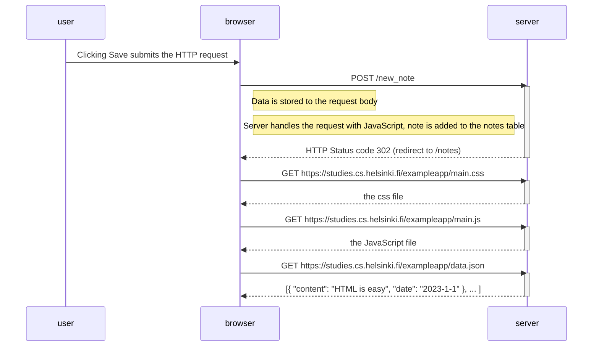

```mermaid
sequenceDiagram

    participant user
    participant browser
    participant server

    user->>browser: Clicking Save submits the HTTP request

    browser->>server: POST /new_note
    activate server
    Note right of browser: Data is stored to the request body

    Note left of server: Server handles the request with JavaScript, note is added to the notes table

    server-->>browser: HTTP Status code 302 (redirect to /notes)
    deactivate server

    browser->>server: GET https://studies.cs.helsinki.fi/exampleapp/main.css
    activate server
    server-->>browser: the css file
    deactivate server
    
    browser->>server: GET https://studies.cs.helsinki.fi/exampleapp/main.js
    activate server
    server-->>browser: the JavaScript file
    deactivate server

    browser->>server: GET https://studies.cs.helsinki.fi/exampleapp/data.json
    activate server
    server-->>browser: [{ "content": "HTML is easy", "date": "2023-1-1" }, ... ]
    deactivate server 
```