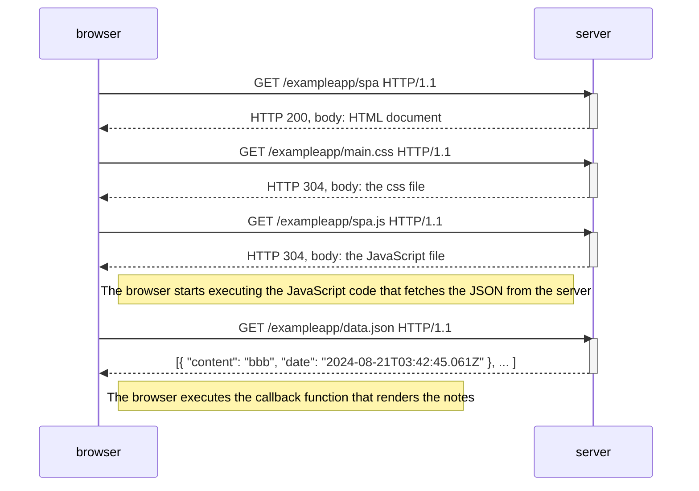

```mermaid
sequenceDiagram
    participant browser
    participant server
    
    browser->>server: GET /exampleapp/spa HTTP/1.1
    activate server
    server-->>browser: HTTP 200, body: HTML document
    deactivate server
    
    browser->>server: GET /exampleapp/main.css HTTP/1.1
    activate server
    server-->>browser: HTTP 304, body: the css file
    deactivate server
    
    browser->>server: GET /exampleapp/spa.js HTTP/1.1
    activate server
    server-->>browser: HTTP 304, body: the JavaScript file
    deactivate server
    
    Note right of browser: The browser starts executing the JavaScript code that fetches the JSON from the server
    
    browser->>server: GET /exampleapp/data.json HTTP/1.1
    activate server
    server-->>browser: [{ "content": "bbb", "date": "2024-08-21T03:42:45.061Z" }, ... ]
    deactivate server    

    Note right of browser: The browser executes the callback function that renders the notes 
```