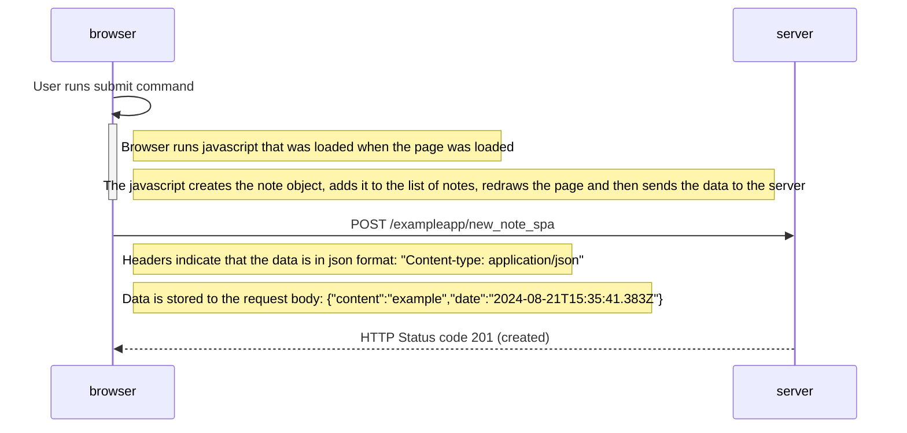

```mermaid
sequenceDiagram
    participant browser
    participant server

    browser->>browser: User runs submit command
    activate browser
    Note right of browser: Browser runs javascript that was loaded when the page was loaded
    Note right of browser: The javascript creates the note object, adds it to the list of notes, redraws the page and then sends the data to the server
    deactivate browser

    browser->>server: POST /exampleapp/new_note_spa
    Note right of browser: Headers indicate that the data is in json format: "Content-type: application/json"
    Note right of browser: Data is stored to the request body: {"content":"example","date":"2024-08-21T15:35:41.383Z"}
    server-->>browser: HTTP Status code 201 (created)

```